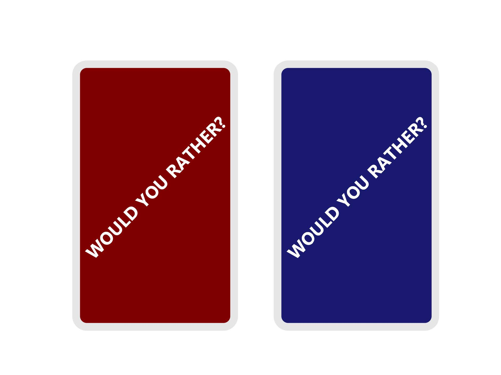
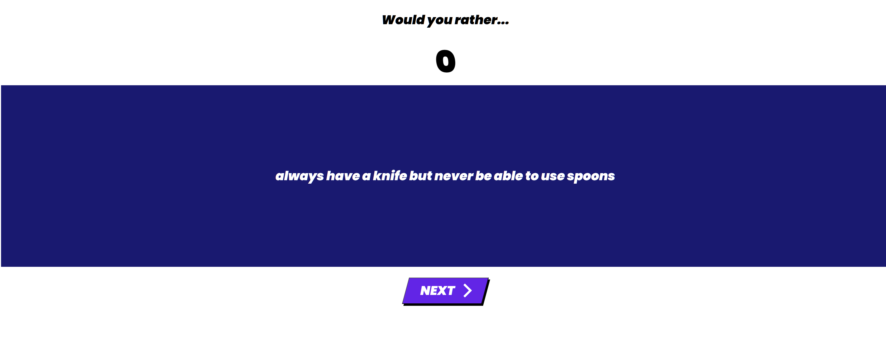

# Consensus Conundrum (a twist on Would You Rather...?)

A simple, silly game concept to properly emphasize how the meta-game aspects can amplify the game experience.
The app consists of a simple frontend browser interface built with React, and an Express backend to proxy the calls to an API server, passing in the necessary credentials.

## How to play

### Components

- A set of cards with red on one side and blue on the other



### Rules

- All players are dealt 3 cards each
- The two prompts are read, all players have 15 seconds to choose which prompt they think will be most popular, and place a card with that prompt’s colour facing up in front of them, with their hand covering it
- After the 15 seconds is up, all players reveal their choices
- If a player chooses the prompt that isn’t the majority, they lose that card. If a player loses all their cards, they are eliminated from the game
- The game continues on to the next round, so on and so forth, until one player remains, and they are declared the winner
- In the event of a 50/50 draw, no players lose

## Run the game locally

After cloning the repository, you need to setup a `.env` in your [root](https://github.com/thelazyant164/ConsensusConundrum/tree/main) directory with the following content:

```
PORT=...
RAPID_API_KEY=...
RAPID_API_HOST=...
RAPID_API_URL=...
```

Sign up over at RapidAPI to get your own `KEY`, `HOST` and `URL` values.

First, run the backend - under [root](https://github.com/thelazyant164/ConsensusConundrum/tree/main):

```
npm start
```

Then run the frontend - under [/frontend](https://github.com/thelazyant164/ConsensusConundrum/tree/main/frontend):

```
npm start
```

A game instance should be accessible via any browser client at `http://localhost:PORT`. For instance, if the specified `PORT` is `3000`, the game will be accessible at `http://localhost:3000`.


When the countdown timer expires, the answer should be revealed.



Player should be able to click on the "Next" button to proceed to the next round.

## Built with

### Frontend

- [React](https://reactjs.org/docs/getting-started.html) - frontend view-layer library for building the software's browser-based user interface
- [Axios](https://axios-http.com/docs/intro) - HTTP client for querying data from backend endpoint

### Backend

- [Express](https://expressjs.com/) - backend middleware-based web framework
- [Axios](https://axios-http.com/docs/intro) - promise-based library for fetching data from external API
- [Would You Rather API](https://rapidapi.com/thunderapi-thunderapi-default/api/would-you-rather) - endpoint for fetching prompt options

## Author

- **Ân Thiên Lý** - _Developer, designer_ - [thelazyant164](https://github.com/thelazyant164)
- Lochlan (dammit what's your last name again?) - _Designer_
- (third guy whose name I absolutely remember) - _Designer_

## Acknowledgements

- [Imran Pardes](https://codepen.io/folaad) for the fancy "Next" button
